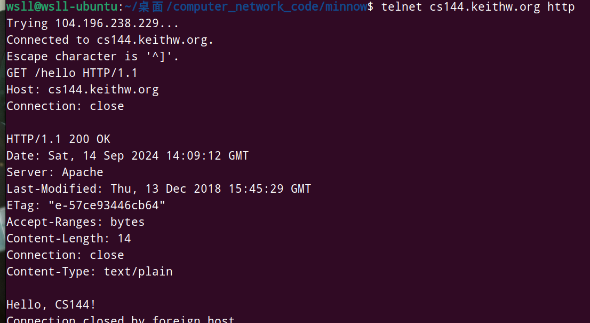
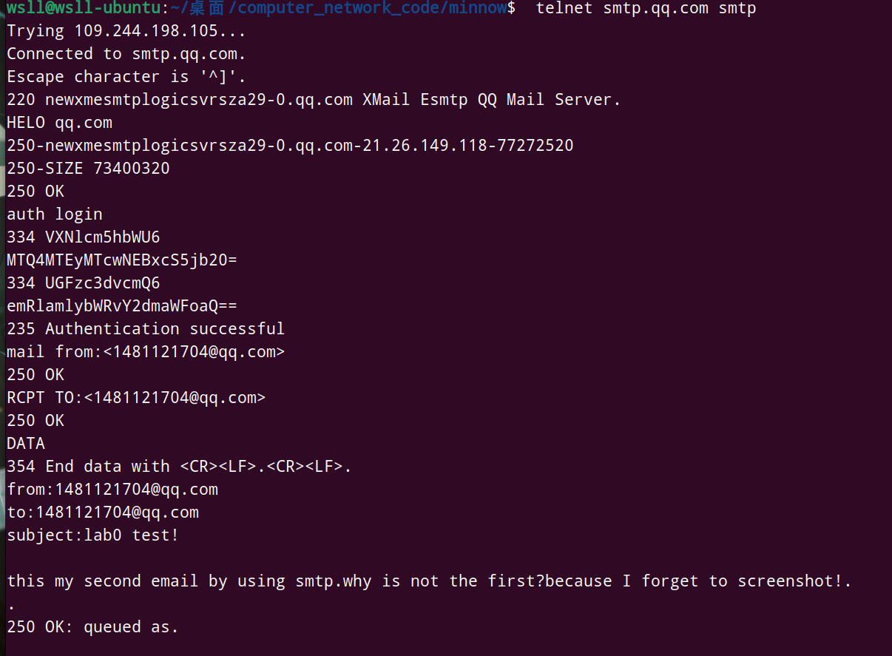
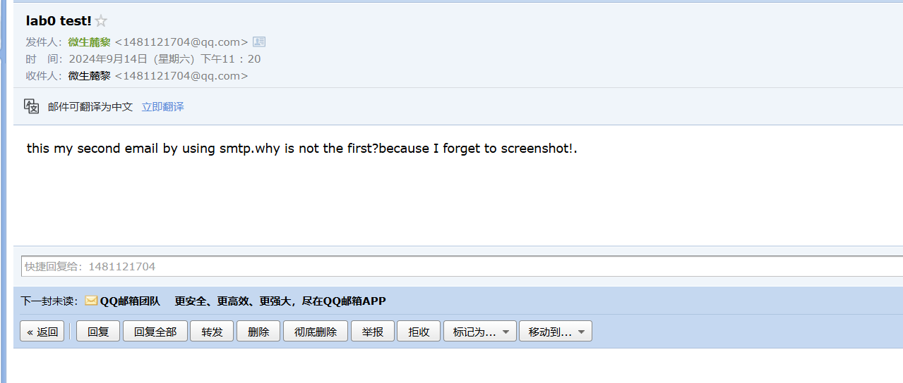
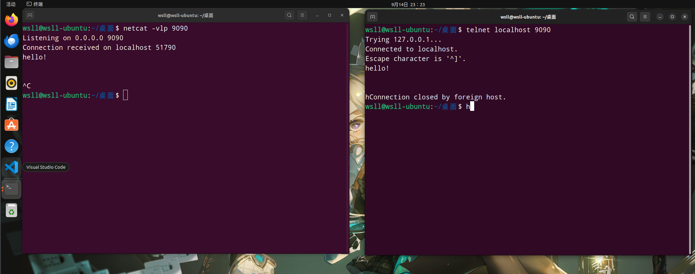
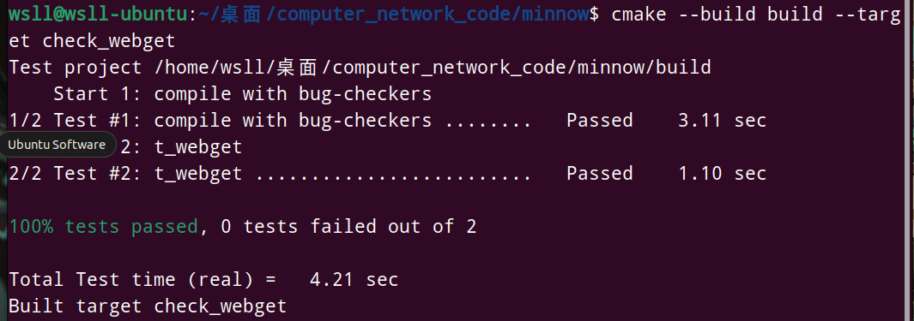
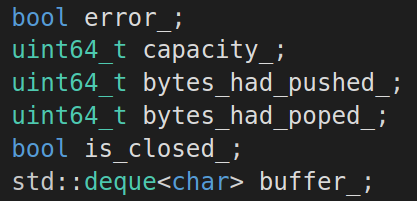
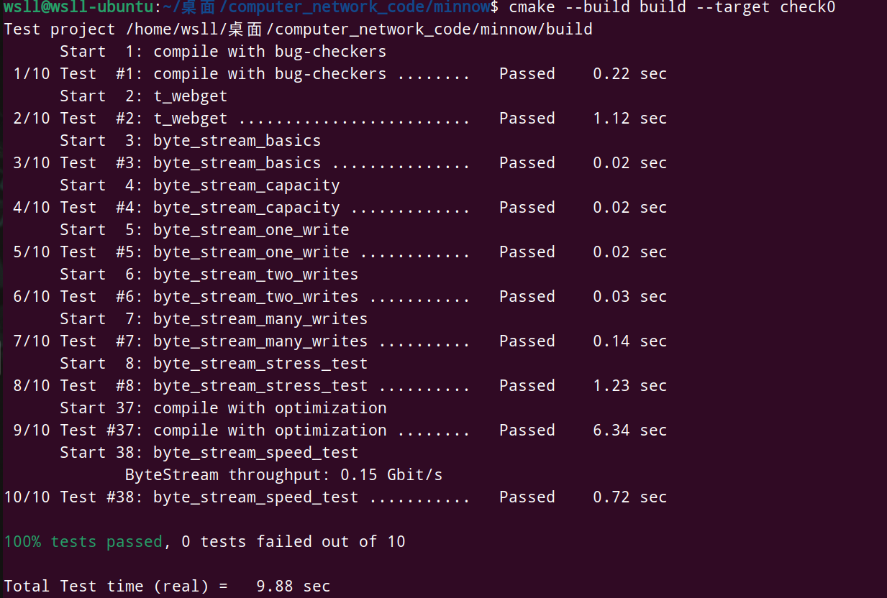

# Lab 0 报告

## 1. Lab 0.2

以下是lab0.2的图片：
## lab 2.1

## lab 2.2

## lab 2.3

## 2.Lab 0.3

### 写代码前的准备
在实验前，需要阅读<socket.hh> <file_descriptor.hh><address.hh>等多个头文件
### coding
按照 构建服务器主机信息--创建套接字--connect--构建request--写入套接字--读取套接字的信息进行。
### 注意的点
我们在构建request时模拟lab0.2.1的情况，在末尾加上“\r\n"
### 测试截图

## 3. Lab 0.4

### 设计思路：
#### ByteStream 类成员的设计

1. **error_**
我们注意到有 set_error函数，因此我们需要写一个error_.（虽然我们后面并没有使用到它）
2. **capacity_**
用来标识最大容量
3. **bytes_had_pushed_**
用来标识已经push了多少字节。（虽然只有Writer会用到这个参数，但是由于实验要求，我们也把放到父类了）
4. **bytes_had_poped_**
用来标识已经pop了多少字节。（虽然只有Reader会用到这个参数，但是由于实验要求，我们也把放到父类了）
5. **is_closed_**
用来标识是否Writer是否已经停止写了
6. **buffer_**
我们用一个deque来模拟。deque的性能虽然略弱于vector，但是差距不大。其实这个场景应使用queue，但是STL的queue默认使用的也是deque，并且deque在控制上比queue容易。
#### 重点成员函数的实现
**Writer::push** 
这里我们需要考虑data长度超过缓冲区的情况。因此我们在available_capacity和data的长度之间取最小值来插入。
**Writer::available_capacity**
我们通过capacity_ - buffer_.size来得到剩余空间。
**Reader::is_finished**
这里需要注意读者读完的条件是写者已经写完并且缓冲区没有数据了。
**Reader::pop**
同Writer::push一样，要考虑缓冲区本身已经空了。
#### 代码过程中出现的问题（均已解决）
##### 初始化问题
第一次编译的时候发生了报错。我在在类的成员变量声明时赋初值，但是没有使用初始化列表。提示是Byte_stream的类成员变量没有在初始化列表中初始化。但是c++11以后似乎支持在类的成员变量声明时赋初值。我后来发现，是我在初始化列表中又一次给capcity_初始化了（代码模版中自带的），从而导致了这个问题
##### string_view
我在第一次编译时不了解string_view的用法，错误地以为它有构造函数string_view(char)。最终经过学习，更改成了正确的用法。
##### Writer::push和Reader::pop
我在第二次编译时提示测试出错。经过检查，是我阅读文档不仔细，误认为是写入时超出缓冲区容量直接设置出错。

#### 测试成功截图

#### 测试总结 
0.15Gbit/s的速度不算太快。这应该是deque的速度制约导致的。或许采取更优秀的结构能做到速度更快。